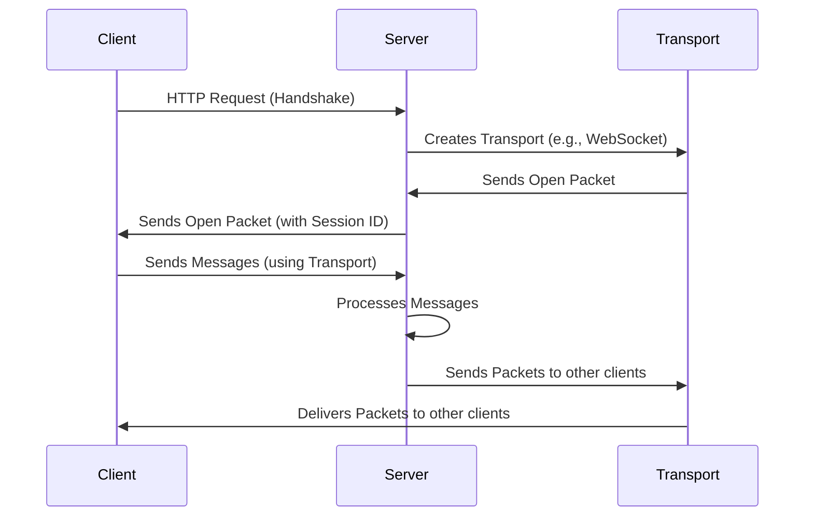

# Chapter 1: Engine

Welcome to the first chapter of our `socket.io` tutorial! In this series, we're going to build our understanding of `socket.io` from the ground up, starting with the core components. Think of it like building a house – we need to understand the foundation before we can build the walls and the roof!

Let's kick things off with the **Engine**.

Imagine you're building a chat application. Users should be able to send messages to each other in real-time.  That's where `socket.io` comes in! But how do these messages actually *get* from one user's browser to another? The Engine is the unsung hero that makes this happen. It's the underlying layer that handles the low-level communication.

## What is the Engine?

The Engine is the heart of `socket.io`'s real-time communication. Think of it as the postal service for our chat app.

*   **The Problem:** How do we get messages reliably from one place (a user's device) to another (another user's device)?

*   **The Engine's Role:** The Engine manages the actual sending and receiving of data packets over the network. It provides a low-level abstraction for the transport protocol.  It uses different methods (called "transports") to do this – like different postal services, such as mail, air, etc.

So, the Engine is responsible for:

1.  **Choosing a Transport:**  It picks the best method for sending data (like polling or WebSockets). Think of these as the different postal services available.
2.  **Sending and Receiving Data:**  It formats the data into packets and sends them across the network.
3.  **Handling Connection Details:** Managing the connection with each client and ensuring reliable data transfer.

## Key Concepts

Let's break down the Engine into some key concepts. These are like the essential parts of our postal service:

1.  **Transports:** The actual methods used to send data.
    *   **Polling:** A simple method where the client repeatedly asks the server for updates.  Think of it as checking your mailbox every few seconds.
    *   **WebSockets:** A more efficient, persistent connection that allows for real-time communication. Like having a direct phone line to the server!

    The Engine is flexible enough to use different transports based on what the client and server support.

2.  **Packets:** The Engine uses "packets" to package and transmit data. Packets are the basic units of data transmitted.  These are like the letters or packages that the postal service delivers. We'll talk more about Packets in [Chapter 5: Packet](05_packet_.md)!

3.  **Sockets:** Sockets represent the connection between the server and a client. Think of them as a particular postal worker assigned to a specific house. We'll explore Sockets in [Chapter 3: Socket](03_socket_.md).

## Solving the Chat App Problem

Let's see how the Engine works in our chat application example:

1.  **Client Sends a Message:** A user types a message in their chat application and clicks "send".
2.  **Message Packaged:** The message is packaged into a packet.
3.  **Engine Transports the Packet:** The Engine uses a transport (perhaps WebSockets) to send the packet over the network to the server.
4.  **Server Receives the Packet:** The server receives the packet.
5.  **Server Broadcasts the Packet:** The server sends the packet to other connected clients (using the Engine again!).
6.  **Other Clients Receive the Packet:** The other clients receive the packet, and display the message in their chat windows.

## Code Snippets and Explanation

Let's look at a simplified example of how the Engine is used in Node.js. Remember the `engine.io.ts` file from the introduction?  It creates an HTTP server, ready to handle WebSocket upgrades.

```typescript
--- File: packages\engine.io\lib\engine.io.ts ---
import { createServer } from "http";
import { Server, AttachOptions, ServerOptions } from "./server";

// ... other imports ...

function listen(port, options: AttachOptions & ServerOptions, fn) {
  // ... code to create the HTTP server ...

  // create engine server
  const engine = attach(server, options);

  // ... listen on the given port ...
}

```

This code sets up the basics. It starts by creating an HTTP server using `createServer`. Then, it uses the `attach` function to integrate the Engine with the HTTP server. This is how the Engine starts listening for connections and preparing for real-time communication!

Now, let's see how the Engine actually "attaches" itself to the HTTP server.

```typescript
--- File: packages\engine.io\lib\engine.io.ts ---
function attach(server, options: AttachOptions & ServerOptions) {
  const engine = new Server(options);
  engine.attach(server, options);
  return engine;
}
```

Here, `attach` creates a new `Server` instance (which we'll dive into soon) and calls `engine.attach()`. This is the key part where the Engine integrates with your existing HTTP server.

The `Server` class (defined in `server.ts`) is the core of the Engine.

```typescript
--- File: packages\engine.io\lib\server.ts ---
export class Server extends BaseServer {
    // ... many properties and methods ...
}
```

The `Server` class handles incoming connections and manages the lifecycle of the Engine.

## Behind the Scenes: Sequence Diagram

Let's visualize the connection process with a sequence diagram. Imagine a simplified example:



In this diagram:

*   The client initiates a handshake.
*   The server creates a transport for the client.
*   The server and client exchange open packets.
*   The client and server communicate via messages using the transport.

## Internal Implementation (Simplified)

Let's explore the internal implementation. We won't dive into every detail, but let's look at key parts.

1.  **Creating a Transport:** The `Server` class needs to decide which transport to use.

    The `createTransport` method is used to initialize a particular transport.

    ```typescript
    --- File: packages\engine.io\lib\server.ts ---
    protected createTransport(transportName: string, req: IncomingMessage) {
        return new transports[transportName](req);
    }
    ```

2.  **Handling HTTP Requests:** The Engine's `handleRequest` method processes the HTTP requests. This is where the Engine figures out what the client is asking for.

    ```typescript
    --- File: packages\engine.io\lib\server.ts ---
    public handleRequest(req: EngineRequest, res: ServerResponse) {
        // ... prepare the request ...
        if (req._query.sid) {
            // existing client
            this.clients[req._query.sid].transport.onRequest(req);
        } else {
            // new client
            this.handshake(req._query.transport, req, closeConnection);
        }
    }
    ```

    This method checks if it's a new connection or an existing one. If it's a new connection, it will call `handshake()`.

3.  **Handshake:**  The `handshake` method sets up the initial connection.

    ```typescript
    --- File: packages\engine.io\lib\server.ts ---
    protected async handshake(
        transportName: string,
        req: any,
        closeConnection: (errorCode?: number, errorContext?: any) => void,
    ) {
        // ... determine the protocol ...
        let id;
        try {
            id = await this.generateId(req);
        } catch (e) {
            // ... error handling ...
        }
        var transport = this.createTransport(transportName, req);
        const socket = new Socket(id, this, transport, req, protocol);
        // ... set up event listeners ...
        this.clients[id] = socket;
        this.clientsCount++;
        // ... emit connection event ...
    }
    ```

    The `handshake` method creates a new `Socket` object, which represents the connection to a specific client. It then sets up the transport.

## Conclusion

You've now taken your first steps into understanding the Engine! We've explored its fundamental role in handling real-time communication, its key components, and how it integrates with HTTP servers.  We also saw how it interacts with other components.  It's like we've built the foundation of our house.

In the next chapter, we'll look at the [Chapter 2: Manager](02_manager_.md) – the component that helps organize and manage all these connections.


---

Generated by [AI Codebase Knowledge Builder](https://github.com/The-Pocket/Tutorial-Codebase-Knowledge)