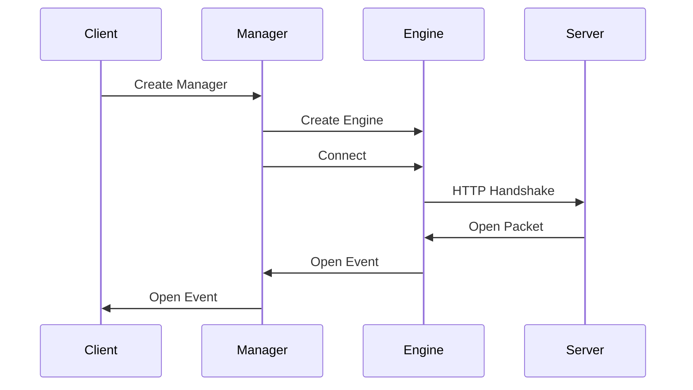

# Chapter 2: Manager

Welcome back! In the previous chapter, [Chapter 1: Engine](01_engine_.md), we learned about the Engine, the component that handles the low-level details of sending and receiving data. Now, let's explore the **Manager**, the component that sits on top of the Engine and is responsible for managing the connection to the server.

## What is the Manager?

Imagine you're building a real-time collaborative drawing application. Several users should be able to draw on the same canvas, and everyone sees the others' strokes instantly. This is where the Manager comes in to play.

The Manager acts like the central control center for your application's connection to the server. It's responsible for:

*   Establishing the connection with the server, using the Engine under the hood.
*   Handling reconnection attempts if the connection drops.
*   Managing multiple "namespaces" (we'll cover those in a later chapter!), which allows you to organize your real-time communication.

Think of it as the telephone operator for your application. It dials the server's number, keeps the line open, and redials if the connection gets cut off.

## Key Concepts

Let's break down the Manager into its core components.

1.  **Engine Instance:** The Manager uses an instance of the [Engine](01_engine_.md) to establish and maintain the underlying connection. The Engine handles the low-level details of the connection, like the transport and data formatting. The Manager *owns* the Engine, meaning it's responsible for creating, managing, and closing it.

2.  **Connection and Reconnection Logic:** The Manager takes care of connecting to the server and, if the connection is lost, retrying the connection. It has built-in logic to handle disconnections, and it will automatically attempt to reconnect to the server after a brief delay. This helps make your application more robust.

3.  **Namespaces (Brief Overview):** The Manager can manage connections to different "namespaces". Think of namespaces as separate communication channels within your application. For example, you might have a namespace for general chat messages and another for private messages. We'll dive into namespaces in [Chapter 4: Namespace](04_namespace_.md).

## Solving the Drawing App Problem

Let's see how the Manager works in our collaborative drawing application example:

1.  **Application Starts:** The application initializes a Manager, providing the server's address.
2.  **Manager Connects:** The Manager uses the Engine to connect to the server.
3.  **Connection Established:** The Manager establishes a connection to the server and signals that the connection is ready.
4.  **User Draws:** A user draws a stroke on their canvas.
5.  **Message Sent:** The application sends the stroke data to the server using a socket.
6.  **Server Broadcasts:** The server receives the stroke data and broadcasts it to all connected clients.
7.  **Other Clients Receive:** The Manager on each client receives the broadcast and the drawings are updated.

## Code Snippets and Explanation

Let's look at a simplified code example. We'll be creating a Manager instance:

```javascript
import { Manager } from "socket.io-client";

const manager = new Manager("http://localhost:3000");
```

This code creates a new `Manager` instance. The constructor takes the server's URL as a parameter.  This tells the Manager where to connect.  That's all we need to create our connection manager!

Let's explore another example with options:

```javascript
import { Manager } from "socket.io-client";

const manager = new Manager("http://localhost:3000", {
  reconnection: true, // Enable reconnection
  reconnectionDelay: 1000, // Delay between reconnection attempts (in milliseconds)
  reconnectionAttempts: 5, // Maximum reconnection attempts
});
```

In this example, we're configuring the Manager with some options:

*   `reconnection: true`: Enables automatic reconnection.
*   `reconnectionDelay: 1000`: Sets a 1-second delay before each reconnection attempt.
*   `reconnectionAttempts: 5`: Sets a limit of 5 reconnection attempts.

The Manager automatically handles the connection and reconnection process behind the scenes, based on these options.

## Internal Implementation (Simplified)

Let's visualize the core steps the Manager takes when establishing a connection:



1.  **Create Manager:** The client application creates a `Manager` instance, providing the server's URL.
2.  **Create Engine:** The `Manager` creates an instance of the [Engine](01_engine_.md) to handle low-level communication.
3.  **Connect:** The `Manager` calls the `connect` method of the Engine to start the connection process.
4.  **HTTP Handshake:** The Engine initiates an HTTP handshake with the server.
5.  **Open Packet:** The server responds with an "open" packet, which contains session information.
6.  **Open Event:** The Engine emits an "open" event to the Manager.
7.  **Open Event:** The Manager emits an "open" event to the client, signaling that the connection is established.

Now, let's look at a small snippet of code illustrating how the Manager establishes the connection with the server by using the Engine:

```typescript
--- File: packages\socket.io-client\lib\manager.ts ---
  public open(fn?: (err?: Error) => void): this {
    debug("readyState %s", this._readyState);
    if (~this._readyState.indexOf("open")) return this;

    debug("opening %s", this.uri);
    this.engine = new Engine(this.uri, this.opts);
    // ... rest of the code ...
  }
```

Here's what's happening:

*   `this.engine = new Engine(this.uri, this.opts);`: This is where the Manager creates a new Engine instance, passing in the server URL and any configured options. This is a key line: The Manager *creates* the Engine and will manage its lifecycle.
*   The rest of the code (omitted) sets up event listeners on the Engine to handle the connection and disconnection events.

Let's quickly examine how the Manager handles the 'close' event and initiates reconnection:

```typescript
--- File: packages\socket.io-client\lib\manager.ts ---
  private onclose(reason: string, description?: DisconnectDescription): void {
    // ... cleanup code ...
    this.engine?.close();
    this.backoff.reset();
    this._readyState = "closed";
    this.emitReserved("close", reason, description);

    if (this._reconnection && !this.skipReconnect) {
      this.reconnect();
    }
  }
```

Here:

*   When the Engine signals a connection close event, `onclose` is called.
*   It calls `this.engine?.close()` to close the Engine instance (and the underlying connection).
*   `this.reconnect()` is called if reconnection is enabled and not skipped. The `reconnect` method contains the logic for attempting to reconnect to the server, including handling delays and retries.

## Conclusion

In this chapter, we learned about the Manager, the component that manages the connection to the server and handles reconnection. We explored how it uses the Engine and sets up reconnection logic. We saw how it all works together to make your real-time application more robust.

In the next chapter, we'll explore [Chapter 3: Socket](03_socket_.md), which represents the individual connection to a specific namespace.


---

Generated by [AI Codebase Knowledge Builder](https://github.com/The-Pocket/Tutorial-Codebase-Knowledge)