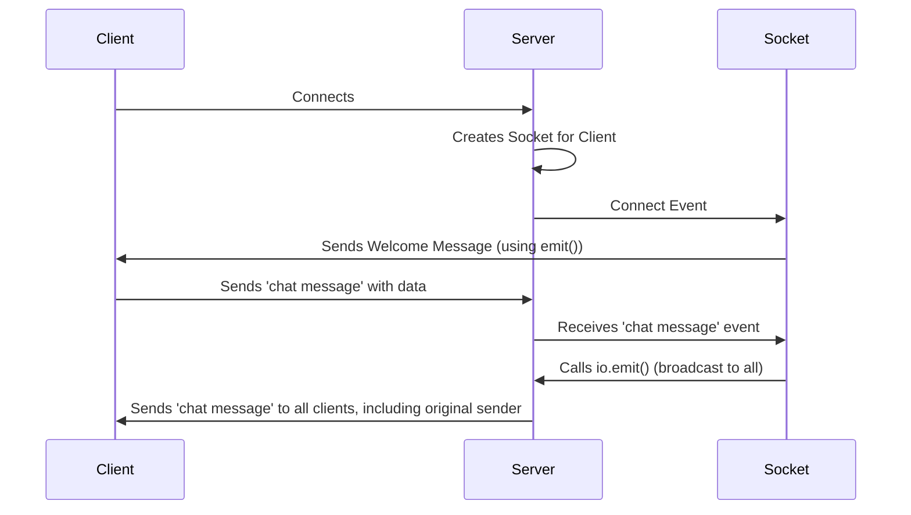

# Chapter 3: Socket

Welcome back! In the previous chapter, [Chapter 2: Manager](02_manager_.md), we explored the Manager, which handles the connection and reconnection logic. Now, let's dive into the **Socket**, the core abstraction for a connection with a client.

Imagine you're building a simple chat application. Each user needs their own dedicated "line" to send and receive messages. That's where the Socket comes in! It's like a phone line – a unique connection between the server and each individual user.

## What is a Socket?

The Socket is the central point of communication for a single client. Think of it as the server's representation of a connected user. It's the object that allows you to send messages *to* and receive messages *from* a specific user.

*   **The Problem:** How does the server keep track of and communicate with each individual user connected to the chat application?

*   **The Socket's Role:** The Socket provides a dedicated channel for communication.  It handles events like "connect" (when a user connects), "message" (when a user sends a message), and "disconnect" (when a user leaves).

So, the Socket is responsible for:

1.  **Identifying a Client:** Each Socket has a unique ID. This is like the client's phone number.
2.  **Sending Messages:**  You use the Socket to send messages *to* a specific client.
3.  **Receiving Messages:** The Socket listens for messages coming *from* a specific client.
4.  **Handling Connection Events:** The Socket manages the connection lifecycle (connecting, disconnecting, etc.).

## Key Concepts

Let's break down the Socket into some key concepts.

1.  **Unique ID:** Each Socket has a unique identifier (like a phone number) so the server knows who it's talking to.

2.  **Events:** The Socket emits events that you can listen to, such as:
    *   `connect`:  When the client first connects.
    *   `message`: When the client sends a message.
    *   `disconnect`: When the client disconnects.

3.  **Methods:** The Socket has methods to send messages, join/leave rooms, and more. Some important ones include:
    *   `emit()`: Sends an event to the client (the main way to send data).
    *   `join()`: Adds the client to a "room" (a way to group clients).
    *   `leave()`: Removes the client from a room.
    *   `disconnect()`: Closes the connection with the client.

## Solving the Chat App Problem

Let's see how the Socket works in our simple chat application:

1.  **Client Connects:**  A user opens the chat application, and the client connects to the server.
2.  **Socket Created:** The server creates a new Socket instance, assigning it a unique ID, and the `connect` event is emitted.
3.  **Client Sends Message:** The user types a message and clicks "send". The client sends the message to the server.
4.  **Server Receives Message:** The server receives the message *through* the Socket.
5.  **Server Broadcasts Message:** The server, perhaps using the Socket's ID, sends the message to other users.
6.  **Other Clients Receive Message:**  Other clients receive the message and display it.
7.  **Client Disconnects:** The user closes the chat application.
8.  **Socket Disconnects:** The `disconnect` event is emitted for that Socket instance.

## Code Snippets and Explanation

Let's look at a basic example of how you'd use a Socket in a Node.js server using `socket.io`:

```javascript
io.on('connection', (socket) => {
  console.log('a user connected');
  socket.emit('welcome', 'Welcome to the chat!'); // Send message to client
});
```

Explanation:

*   `io.on('connection', ...)`: This sets up an event listener that triggers whenever a new client connects.
*   `socket`: This is the Socket object, representing the connection to the *new* client.
*   `socket.emit('welcome', 'Welcome to the chat!')`: This sends a message with the event name `welcome` and the message "Welcome to the chat!" *to the specific client* that just connected.

Now, let's handle messages sent *from* the client:

```javascript
io.on('connection', (socket) => {
  socket.on('chat message', (msg) => {
    console.log('message: ' + msg); // Log the message
    io.emit('chat message', msg); // Broadcast to everyone
  });
});
```

Explanation:

*   `socket.on('chat message', (msg) => { ... })`: This sets up a listener for the `chat message` event *from the client*.
*   `msg`: This is the data the client sent with the `chat message` event.
*   `io.emit('chat message', msg)`: This broadcasts the received message to *all* connected clients.

## Internal Implementation (Simplified)

Let's walk through what happens when a client connects and sends a message:



Here's a breakdown:

1.  **Client Connects:** The client initiates a connection.
2.  **Socket Created:** The Server creates a `Socket` instance to represent the client.
3.  **Connect Event:**  The `connect` event is emitted on the Socket.
4.  **Server Sends Welcome Message:** The `emit()` method on the Socket sends a `welcome` message back to the client.
5.  **Client Sends Message:** The client sends a `chat message` to the server.
6.  **Server Receives Message:** The server receives the message through the Socket's `chat message` event handler.
7.  **Server Broadcasts Message:** The `io.emit()` method (usually on the Server) broadcasts the message to all connected clients, including the original sender.

Let's now look at the internal implementation details:

When a client connects, the `Server` creates a `Socket` instance. The important parts of the `Socket` class in `socket.ts` include the event handling and message sending methods.

Here's a simplified look at the `emit()` method (how the server sends a message to the client):

```typescript
--- File: packages\socket.io\lib\socket.ts ---
  public emit<Ev extends EventNames<EmitEvents>>(
    ev: Ev,
    ...args: EventParams<EmitEvents, Ev>
  ): boolean {
    // ... (some checks)
    const data: any[] = [ev, ...args];
    const packet: any = {
      type: PacketType.EVENT,
      data: data,
    };
    // ... (more code)
    this.packet(packet, flags);
    return true;
  }
```

Explanation:

*   `public emit(...)`: This is the method to send an event to the client.
*   `packet = { type: PacketType.EVENT, data: data }`: This creates a packet to be sent.  The packet contains the event name (`ev`) and any data passed as arguments (`...args`).
*   `this.packet(packet, flags)`: This calls the `packet` method (not shown in its entirety), which is responsible for sending the packet to the client via the underlying connection (Engine).

Now, let's look at a very simplified version of how a packet is *received* and handled by the `_onpacket` method:

```typescript
--- File: packages\socket.io\lib\socket.ts ---
  _onpacket(packet: Packet): void {
    switch (packet.type) {
      case PacketType.EVENT:
        this.onevent(packet);
        break;
      // ... other packet types ...
    }
  }
```

Explanation:

*   `_onpacket(packet: Packet)`: This is the method that handles incoming packets from the client.
*   `PacketType.EVENT`: It checks the `packet.type`. If it's an event, it calls `this.onevent(packet)`.

```typescript
--- File: packages\socket.io\lib\socket.ts ---
  private onevent(packet: Packet): void {
    const args = packet.data || [];
    this.dispatch(args);
  }
```

* `this.dispatch(args)`: It eventually calls dispatch with `args`.

```typescript
--- File: packages\socket.io\lib\socket.ts ---
  private dispatch(event: Event): void {
    this.run(event, (err) => {
      process.nextTick(() => {
        if (err) {
          return this._onerror(err);
        }
        if (this.connected) {
          super.emitUntyped.apply(this, event);
        }
      });
    });
  }
```

*   `super.emitUntyped.apply(this, event)`: In this line, the event is emitted to the listeners attached to the socket.

## Conclusion

You've now learned about the Socket!  It's the core object that represents a connection and allows you to send and receive messages to individual clients. We've seen how it handles events and provides methods for communication. In the next chapter, we'll explore [Chapter 4: Namespace](04_namespace_.md), which allows you to organize and structure your real-time application by creating multiple communication channels.


---

Generated by [AI Codebase Knowledge Builder](https://github.com/The-Pocket/Tutorial-Codebase-Knowledge)