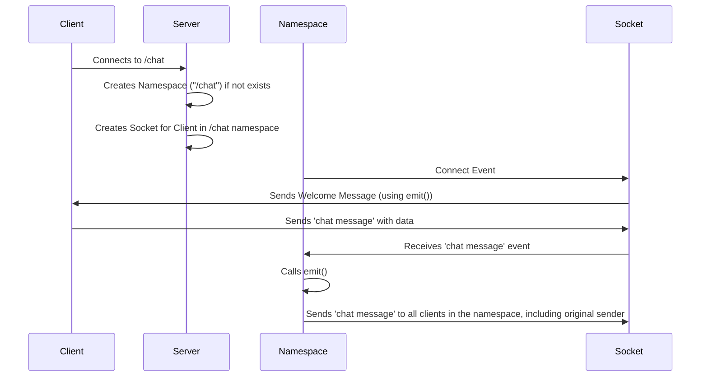

# Chapter 4: Namespace

Welcome back! In the previous chapter, [Chapter 3: Socket](03_socket_.md), we learned all about Sockets – the individual connections to clients. Now, let's dive into **Namespace**, which provides a way to organize your real-time application by creating multiple communication channels.

Imagine you're building a chat application with multiple features: a global chat and a private messaging system. You could handle all the communication in a single place, but things could quickly get messy and hard to manage. This is where Namespaces come to the rescue!

## What is a Namespace?

A Namespace is like a virtual "room" within your `socket.io` server. Think of it as a separate communication channel. Each Namespace has its own set of:

*   **Sockets:** The individual connections ([Sockets](03_socket_.md)) belong to a specific Namespace.
*   **Event Listeners:** You can define different event listeners for each Namespace.
*   **Rooms:** Namespaces allow you to create distinct "rooms" for users to join within a specific context.

This allows you to separate concerns and keep your application logic organized.

## Key Concepts

Let's break down the Namespace into its core concepts:

1.  **Multiple Channels:** Namespaces create isolated communication channels. This prevents messages from one part of your application from interfering with another.

2.  **Isolation:** Sockets connect *to* a specific namespace. This means that events and data are only shared within that namespace.

3.  **Organization:** Namespaces allow you to structure your application logically, making it easier to understand, maintain, and scale. Think of it like organizing files in different folders on your computer.

## Solving the Chat Application Problem

Let's see how Namespaces help us build our chat application with global chat and private messaging:

1.  **`/` (Default) Namespace (Global Chat):**  This namespace handles the global chat functionality. All users connect to this by default.
2.  **`/private` Namespace (Private Messaging):** This namespace manages private conversations between users. Users can connect to this namespace to exchange private messages.

Here's how the code would look like to create two namespaces:

```javascript
const io = require('socket.io')(httpServer); // Assuming your server is set up

const globalChat = io.of('/'); // Default namespace (global chat)
const privateChat = io.of('/private'); // Private messaging namespace
```

In this code:

*   We create two namespaces using `io.of()`. The first argument to `io.of()` is the namespace name, with "/" being the default one.
*   `globalChat` is used to handle events related to the main chat.
*   `privateChat` is used to handle private messages.

Now, let's see how we can add a simple "chat message" event in the globalChat namespace:

```javascript
globalChat.on('connection', (socket) => {
  socket.on('chat message', (msg) => {
    globalChat.emit('chat message', msg); // Broadcast to all clients in globalChat
  });
});
```

Here, when a client in the default namespace sends a "chat message", the server broadcasts it to all other clients connected to the default namespace.

Similarly, we can add code for the privateChat namespace:

```javascript
privateChat.on('connection', (socket) => {
  socket.on('private message', (data) => {
    // Implement private message logic here
    // e.g., send to a specific user based on `data.to`
    privateChat.to(data.to).emit('private message', data.message);
  });
});
```

In this code, when a client in the `/private` namespace sends a `private message`, the server is set up to send the message to the recipient.

## Code Snippets and Explanation

Let's start with a basic example:

```javascript
const io = require('socket.io')(httpServer); // Assuming your server is set up
const chat = io.of('/chat'); // Create a namespace called "chat"

chat.on('connection', (socket) => {
  console.log('a user connected to /chat');
  socket.emit('welcome', 'Welcome to the chat!'); // Send a welcome message
});
```

In this code:

*   We create a namespace called "chat" using `io.of('/chat')`.
*   When a user connects to the `/chat` namespace, a `welcome` event is emitted to that client.

Here's how you would connect to the `/chat` namespace from the client-side (using the `socket.io-client` library):

```javascript
// Client-side code
import { io } from "socket.io-client";
const chatSocket = io("/chat"); // Connect to the /chat namespace

chatSocket.on('welcome', (message) => {
  console.log(message); // Output: Welcome to the chat!
});
```

This client-side code connects to the `/chat` namespace, and then sets up a listener for the `welcome` event.

Let's see how to emit and receive messages within a namespace:

```javascript
// Server-side (inside the chat namespace)
chat.on('connection', (socket) => {
  socket.on('chat message', (msg) => {
    chat.emit('chat message', msg); // Broadcast to everyone in /chat
  });
});
```

```javascript
// Client-side (inside the chat namespace)
chatSocket.on('chat message', (msg) => {
  console.log('Received:', msg);
});
```

In this example, the server listens for "chat message" events, and broadcasts to all connected clients in the chat namespace. The client listens for the same event and displays the message.

## Internal Implementation (Simplified)

Let's visualize what happens when a client connects to a specific namespace and sends a message.



1.  **Client Connects:** The client connects to the `/chat` namespace (e.g., using `io("/chat")`).
2.  **Namespace (If not present) Created:** If a namespace with that name does not already exist, then one is created by the server.
3.  **Socket Created:** The server creates a `Socket` instance specifically for the client *within* the `/chat` namespace.
4.  **Connect Event:** The `connect` event is emitted on the namespace.
5.  **Server Sends Welcome Message:** The `emit()` method on the Socket sends a `welcome` message back to the client.
6.  **Client Sends Message:** The client sends a `chat message` to the server.
7.  **Server Receives Message:** The server receives the message through the Socket's `chat message` event handler.
8.  **Server Broadcasts Message:** The `emit()` method (on the Namespace in this case) broadcasts the message to all connected clients within the `/chat` namespace.

Now, let's peek at some key parts of the internal implementation.

The `Namespace` class (defined in `namespace.ts`) handles the management of each namespace:

```typescript
--- File: packages\socket.io\lib\namespace.ts ---
export class Namespace<
  ListenEvents extends EventsMap = DefaultEventsMap,
  EmitEvents extends EventsMap = ListenEvents,
  ServerSideEvents extends EventsMap = DefaultEventsMap,
  SocketData = any,
> extends StrictEventEmitter<
  ServerSideEvents,
  RemoveAcknowledgements<EmitEvents>,
  NamespaceReservedEventsMap<
    ListenEvents,
    EmitEvents,
    ServerSideEvents,
    SocketData
  >
> {
  public readonly name: string;
  public readonly sockets: Map<
    SocketId,
    Socket<ListenEvents, EmitEvents, ServerSideEvents, SocketData>
  > = new Map();
}
```

Key parts here:

*   `name`: The name of the namespace (e.g., `/chat`, `/private`).
*   `sockets`: A `Map` that stores all the connected [Sockets](03_socket_.md) that belong to this namespace.

Here's the main function for creating a namespace:

```typescript
--- File: packages\socket.io\lib\index.ts ---
  public of<
    ListenEvents extends EventsMap,
    EmitEvents extends EventsMap,
    ServerSideEvents extends EventsMap,
    SocketData
  >(name: string): Namespace<ListenEvents, EmitEvents, ServerSideEvents, SocketData> {
    if (name === "/" || name === "") {
      name = "/";
    }
    if (this.namespaces.has(name)) {
      return this.namespaces.get(name);
    }
    const nsp = new Namespace(this, name);
    this.namespaces.set(name, nsp);
    this.emitReserved("new_namespace", nsp);
    return nsp;
  }
```

*   This function creates a `Namespace` instance and adds it to a collection of namespaces (`this.namespaces`).
*   It checks if a namespace with this name already exists and returns the existing one to avoid creating multiple ones.

The `_add` method (simplified) is called when a client connects to a namespace:

```typescript
--- File: packages\socket.io\lib\namespace.ts ---
  async _add(
    client: Client<ListenEvents, EmitEvents, ServerSideEvents>,
    auth: Record<string, unknown>,
    fn: (
      socket: Socket<ListenEvents, EmitEvents, ServerSideEvents, SocketData>,
    ) => void,
  ) {
    const socket = await this._createSocket(client, auth);
    this.sockets.set(socket.id, socket);
    socket._onconnect();
    this.emitReserved("connect", socket);
    this.emitReserved("connection", socket);
    if (fn) fn(socket);
  }
```

*   This method creates a new `Socket` instance for the client.
*   It then adds the socket to the `sockets` map of the namespace.
*   It triggers the `connect` and `connection` events.

## Conclusion

In this chapter, we've seen how Namespaces allow you to organize your `socket.io` applications into distinct communication channels. This allows you to separate concerns, making your code cleaner and more manageable. You can create multiple namespaces to handle different parts of your application, such as global chat and private messaging.

In the next chapter, we'll explore [Chapter 5: Packet](05_packet_.md), which discusses packets – the fundamental units of data transmitted over the `socket.io` connection.


---

Generated by [AI Codebase Knowledge Builder](https://github.com/The-Pocket/Tutorial-Codebase-Knowledge)