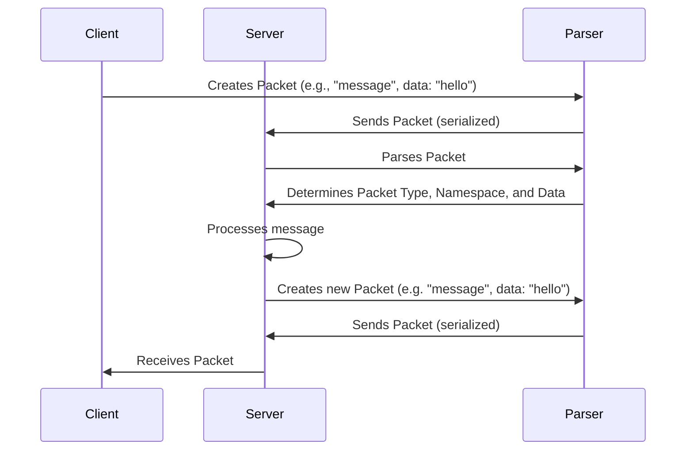

# Chapter 5: Packet

Welcome back! In the previous chapter, [Chapter 4: Namespace](04_namespace_.md), we learned about Namespaces and how they help organize your `socket.io` application. Now, let's dive into **Packet**, the fundamental unit of data transfer in `socket.io`.

Imagine you're building a simple chat application. You have a few users connected, and one user types a message: "Hello, everyone!". This message needs to get sent from their browser to the server, and then from the server to all the other users. This is where Packets come in! They're like the postal letters that carry your messages across the network.

## What is a Packet?

A Packet is the fundamental unit of data transferred between the client and the server. Think of it as a postal letter. This "letter" is composed of a type (like "message" or "connect"), a namespace (which [Chapter 4: Namespace](04_namespace_.md) explained), and the data itself (the content of the message).

*   **The Problem:** How do we structure and send data efficiently and reliably between the client and the server?

*   **The Packet's Role:** Packets package the data into a standardized format, enabling the client and server to understand and process it correctly. They contain all the necessary information to route and interpret the data.

So, a Packet essentially:

1.  **Contains a Type:**  This tells the server *what kind* of data it is (e.g., a new connection, a chat message, an acknowledgement of receipt). Think of it as the "subject" line of your letter.
2.  **Specifies a Namespace:**  Indicates the communication channel (see [Chapter 4: Namespace](04_namespace_.md)) the data belongs to. Like the "to" address on your letter, indicating its destination.
3.  **Includes the Data:**  This is the actual content of the message.  Like the main text of your letter, it contains the information you want to send.
4.  **May include an ID:** Used for ACKs.

## Key Concepts

Let's break down the key concepts of a Packet:

1.  **Type:**  The packet type defines *what* the packet represents. There are different types like `connect`, `disconnect`, `message`, and `ack`. This helps the server know how to handle the packet.

2.  **Namespace:** As we learned in [Chapter 4: Namespace](04_namespace_.md), this specifies which "room" the packet belongs to. The server uses this to route the packet to the correct clients.

3.  **Data:** This is the actual information being sent. It can be a simple string, a number, or a more complex object. It's the payload of your message.

4.  **ID (optional):** For Acknowledgements (ACKs). When a client sends an event, it can include an ID. The server then sends back an ACK packet with the same ID to confirm that the event was received.

## Solving the Chat App Problem

Let's revisit our chat application to see how Packets are used:

1.  **User Sends Message:** The user types "Hello, everyone!" and clicks "send".
2.  **Client Creates Packet:** The client creates a `message` packet with:
    *   `type`: `message`
    *   `namespace`: `/` (the default namespace)
    *   `data`: `"Hello, everyone!"`
3.  **Client Sends Packet:** The client sends the packet to the server.
4.  **Server Receives Packet:** The server receives the packet.
5.  **Server Processes Packet:** The server examines the packet's type, namespace, and data.
6.  **Server Broadcasts Packet:** The server sends a new `message` packet, with the same data to all connected clients in the `/` namespace.
7.  **Clients Receive Packet:** All other clients receive the `message` packet.
8.  **Clients Display Message:**  Each client displays "Hello, everyone!" in the chat window.

## Code Snippets and Explanation

Let's see how a packet might look like in code, using JavaScript objects:

```javascript
const packet = {
  type: 'message',
  nsp: '/', // Default namespace
  data: 'Hello, everyone!',
};
```

This is a simple `message` packet. It's destined for the default namespace (`/`) and contains the message "Hello, everyone!".

Let's see an example of a packet with an ID, and a more complex data payload:

```javascript
const packet = {
  type: 'ack',
  nsp: '/private',
  id: 123,
  data: {
    status: 'success',
    message: 'Message delivered!',
  },
};
```

*   `type: 'ack'`: An acknowledgement.
*   `nsp: '/private'`: Private namespace
*   `id: 123`:  The ID that the ACK corresponds to.
*   `data`: An object containing the status of the operation.

These objects represent the packets that are sent between the client and the server. The `socket.io` library handles the actual encoding and decoding of these packets over the network.

## Internal Implementation (Simplified)

Let's illustrate the flow of a packet from the client to the server and back, in a sequence diagram.



Here's a breakdown:

1.  **Client Creates Packet:** The client creates a packet with the necessary information.
2.  **Client Sends Packet:** The packet is sent to the server, often serialized (converted to a string or binary format) by the parser.
3.  **Server Parses Packet:** The server receives the serialized packet and parses it.
4.  **Server Determines Packet Type, Namespace, and Data:** The server analyzes the packet to determine its type, namespace, and data.
5.  **Server Processes Message:** The server processes the message.
6.  **Server Creates Packet (to send to clients):** The server *also* needs to create a packet to send to the other clients.
7.  **Server Sends Packet (serialized):** The server sends the packet to clients.
8.  **Client Receives Packet:** The client receives the packet and handles the message.

Now, let's dive into some simplified code examples:

Let's explore the `encodePacket` function. First, let's look at where it's called:

```typescript
--- File: packages\socket.io\lib\socket.ts ---
  public emit<Ev extends EventNames<EmitEvents>>(
    ev: Ev,
    ...args: EventParams<EmitEvents, Ev>
  ): boolean {
    // ... some checks ...
    const data: any[] = [ev, ...args];
    const packet: any = {
      type: PacketType.EVENT,
      data: data,
    };
    // ... more code ...
    this.packet(packet, flags);
    return true;
  }
```

Here's the `emit` method of a `Socket` object. This function prepares a packet before sending it.

Let's also explore the `packet` function:

```typescript
--- File: packages\socket.io\lib\socket.ts ---
  private packet(packet: Packet, flags: PacketFlags = {}) {
    if (!this.connected) {
      return;
    }

    debug('sending packet %j', packet);
    this.compress(packet, (packet) => {
      this.transport.send(this.encoder.encode(packet, flags));
    });
  }
```

In the code:
1.  The `packet` function receives a packet.
2.  The packet is then encoded.
3.  Finally, the packet is sent using the transport.

## Conclusion

In this chapter, you learned about Packets, the fundamental units of data transferred between the client and server in `socket.io`. You now understand that a Packet has a type, a namespace, and contains data, which helps structure and deliver messages in real-time. This is the building block for communication in `socket.io`.

In the next chapter, we'll learn about the [Chapter 6: Adapter](06_adapter_.md), which handles the storing and sending of data across different clients and different nodes.


---

Generated by [AI Codebase Knowledge Builder](https://github.com/The-Pocket/Tutorial-Codebase-Knowledge)