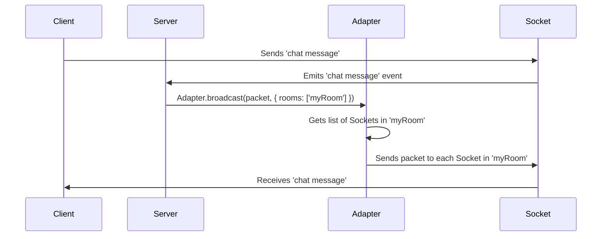

# Chapter 6: Adapter

Welcome back! In the previous chapter, [Chapter 5: Packet](05_packet_.md), we learned about Packets, the fundamental units of data transfer in `socket.io`. Now, let's explore the **Adapter**, the component responsible for handling the broadcasting of packets to the connected clients.

Imagine you are building a chat application. When a user sends a message, that message needs to be delivered to *all* other users in the chat room. The Adapter is the component that makes this happen! It’s like the mailing address book, which stores the list of clients in a room and knows where to send each packet.

## What is the Adapter?

The Adapter is a crucial part of `socket.io` that manages how messages are distributed. It's like the traffic controller for all the packets in your application.

*   **The Problem:** How do we efficiently send messages from the server to the correct clients, especially when we have multiple rooms and users?

*   **The Adapter's Role:** The Adapter keeps track of all the connected clients, organizes them into rooms (groups), and efficiently delivers packets to the right destinations.

Think of it as the central mailing service for your chat application. It handles:

1.  **Tracking Clients:** Keeping a list of all connected [Sockets](03_socket_.md) and their associated rooms. This is like your address book.
2.  **Room Management:**  Allowing clients to join and leave rooms, and managing these room memberships.
3.  **Broadcasting Packets:**  Sending packets to the correct clients based on rooms, and other criteria.  This is the act of delivering mail.

## Key Concepts

Let's break down the Adapter into its core concepts:

1.  **Rooms:** Rooms are logical groupings of clients. Think of them as chat channels or specific areas within your application. A client can be in multiple rooms at the same time.

2.  **Client Membership:** The Adapter keeps track of which clients are in which rooms. It's like a roster for each room.

3.  **Broadcasting Logic:** The Adapter efficiently delivers packets to all clients within a room (or a specific set of clients based on different criteria).

## Solving the Chat App Problem

Let's see how the Adapter works in our chat application, continuing the example of a user sending a message:

1.  **User Sends Message:** The user types a message in the chat and clicks "send".
2.  **Server Receives Packet:** The server receives the `message` [Packet](05_packet_.md).
3.  **Adapter Determines Recipients:** The Adapter, knowing which clients are in the relevant chat room (e.g., the default namespace), identifies the destination clients.
4.  **Adapter Broadcasts Packet:** The Adapter sends the packet to all the clients in the room *except* the sender (unless specified otherwise).
5.  **Clients Receive Message:** All the other clients receive the packet and display the message.

## Code Snippets and Explanation

Let's look at how to create a room and have a client join it.

```javascript
// Server-side
io.on('connection', (socket) => {
  socket.join('myRoom'); // Client joins a room named "myRoom"
  socket.emit('joined', 'You joined myRoom!');
});
```

Explanation:

*   `socket.join('myRoom')`:  This tells the server to add the client (represented by `socket`) to the room named "myRoom".

On the client-side, you'd typically connect to a namespace, and then your code will look like the example below:

```javascript
// Client-side
import { io } from "socket.io-client";
const socket = io(); // Connect to default namespace.

socket.on('joined', (message) => {
  console.log(message); // Output: "You joined myRoom!"
});
```

This client connects to the server, and the server then adds the socket to the room.

Now, let's see how to broadcast a message to a room.

```javascript
// Server-side
io.on('connection', (socket) => {
  socket.on('chat message', (msg) => {
    io.to('myRoom').emit('chat message', msg); // Broadcast to "myRoom"
  });
});
```

Explanation:

*   `io.to('myRoom')`:  This targets the "myRoom" room.
*   `.emit('chat message', msg)`: This emits the 'chat message' event, with the message data, to all sockets in the 'myRoom' room.

## Internal Implementation (Simplified)

Let's visualize what happens when a message is broadcast to a room:



Here's what happens step-by-step:

1.  **Client Sends Message:** A client sends a chat message.
2.  **Socket Emits Event:** The client emits a `chat message` event, triggering the server's event listener.
3.  **Adapter Broadcasts:** The server calls the `Adapter.broadcast()` method, specifying the room to broadcast to.
4.  **Adapter Gets Sockets:** The Adapter looks up all the [Sockets](03_socket_.md) in the specified room.
5.  **Adapter Sends to Sockets:** The Adapter sends the message [Packet](05_packet_.md) to each of the [Sockets](03_socket_.md) in the room.
6.  **Client Receives Message:** Each client in the room receives the message and displays it.

Now, let's delve into some code snippets to understand the inner workings.

First, let's explore the `broadcast` method in the in-memory adapter.

```typescript
--- File: packages\socket.io-adapter\lib\in-memory-adapter.ts ---
  public broadcast(packet: any, opts: BroadcastOptions): void {
    const flags = opts.flags || {};
    const packetOpts = {
      preEncoded: true,
      volatile: flags.volatile,
      compress: flags.compress,
    };
    packet.nsp = this.nsp.name;
    const encodedPackets = this._encode(packet, packetOpts);

    this.apply(opts, (socket) => {
      if (typeof socket.notifyOutgoingListeners === "function") {
        socket.notifyOutgoingListeners(packet);
      }

      socket.client.writeToEngine(encodedPackets, packetOpts);
    });
  }
```

Here, what we observe:

1.  It checks the `opts` that were passed to broadcast the packet (such as the room).
2.  It then calls the `apply` method that will iterate through the clients and send the `encodedPackets` to the correct clients.

Let's now dive into the `apply` method.

```typescript
--- File: packages\socket.io-adapter\lib\in-memory-adapter.ts ---
  private apply(opts: BroadcastOptions, callback: (socket) => void): void {
    const rooms = opts.rooms;
    const except = this.computeExceptSids(opts.except);

    if (rooms.size) {
      const ids = new Set();
      for (const room of rooms) {
        if (!this.rooms.has(room)) continue;

        for (const id of this.rooms.get(room)) {
          if (ids.has(id) || except.has(id)) continue;
          const socket = this.nsp.sockets.get(id);
          if (socket) {
            callback(socket);
            ids.add(id);
          }
        }
      }
    } else {
      for (const [id] of this.sids) {
        if (except.has(id)) continue;
        const socket = this.nsp.sockets.get(id);
        if (socket) callback(socket);
      }
    }
  }
```

In this code:

1.  The `apply` method takes `opts`, such as rooms and except and calls a callback function for the clients within the scope defined by `opts`.
2.  If rooms are provided, it iterates through each room, finds the sockets within that room (using `this.rooms.get(room)`), and executes the `callback` function on each socket (that's the core logic).
3.  If no rooms are specified, it iterates through all the sockets and executes the `callback`.

This internal logic shows how the Adapter efficiently identifies and sends messages to the correct clients.

## Conclusion

In this chapter, you learned about the Adapter. It manages client connections, organizes them into rooms, and efficiently broadcasts messages. You now understand how the Adapter uses rooms and client membership to deliver packets to the right destinations.

In the next chapter, we will end the tutorial series and consolidate the information learned so far.


---

Generated by [AI Codebase Knowledge Builder](https://github.com/The-Pocket/Tutorial-Codebase-Knowledge)