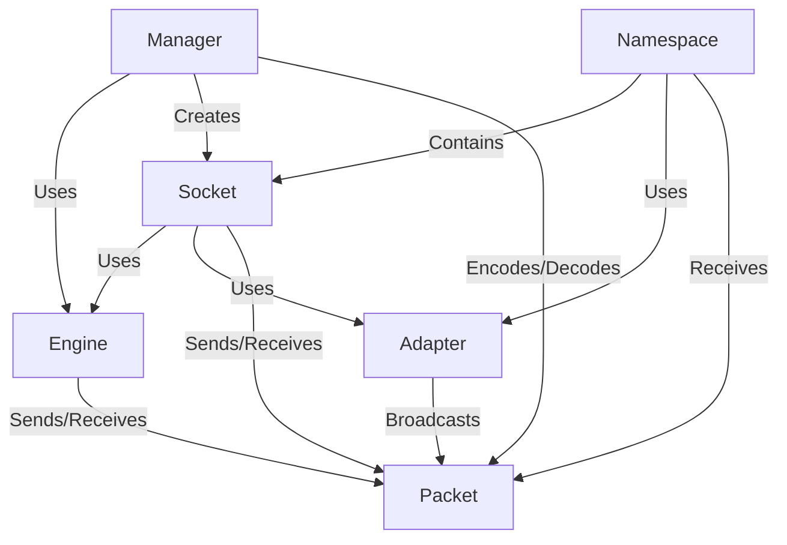

# Tutorial: socket.io

The *socket.io* project enables *real-time, bidirectional* communication between web clients and servers. It provides a higher-level abstraction *over WebSockets* and other transport protocols (like HTTP long-polling) to make it easier to build *live web applications*. The project handles things like connection management, *packet serialization and deserialization*, and broadcasting messages.

**Source Repository:** [https://github.com/socketio/socket.io.git](https://github.com/socketio/socket.io.git)

## Chapters

1. [Engine
](01_engine_.md)
2. [Manager
](02_manager_.md)
3. [Socket
](03_socket_.md)
4. [Namespace
](04_namespace_.md)
5. [Packet
](05_packet_.md)
6. [Adapter
](06_adapter_.md)

---

Generated by [AI Codebase Knowledge Builder](https://github.com/The-Pocket/Tutorial-Codebase-Knowledge)